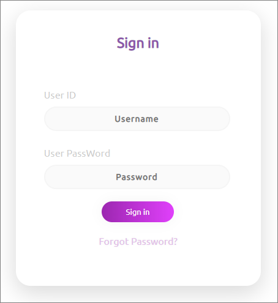

# React and JSX

본 가이드는 React 프로젝트를 수행하는 UI 개발자 교육용으로 작성되었으며, windows OS 환경을 기준으로 작성되었습니다.

---

## 목차

- [환경설정](#환경설정)
    - [확인사항](#확인사항)
        - node.js, npm, yarn, VSCode, git, nvm
    - [환경 세팅 및 프로젝트 생성](#환경-세팅-및-프로젝트-생성)
        - [react-create-app 설치](#react-create-app-설치)
        - [react 프로젝트 생성](#react-프로젝트-생성)
        - [react 프로젝트 실행](#react-프로젝트-실행)
    - [추가 환경 세팅](#추가-환경-세팅)
        - ESlint
        - Reactjs code snippets(Dev. Charalampos Karypidis)
- [JSX](#jsx)
    - [기본코드의 이해](#기본코드의-이해)
    - [HTML 속성](#html-속성)
        - [기본 규칙](#기본-규칙)
        - [className](#classname)
        - [htmlFor](#htmlfor)
        - [tabIndex](#tabindex)
        - [readOnly](#readonly)
    - [감싸는 요소](#감싸는-요소)
    - [태그 닫힘](#태그-닫힘)
    - [style](#style)
    - [주석](#주석)
    - [Forms - Default Value](#forms---default-value)
        - [select](#select)
        - [input](#input)
    - [문자열 리터럴 - 공백문자와 개행](#문자열-리터럴---공백문자와-개행)

---

## 환경설정

react 설치 및 이전에 설치되어 있어야 할 환경에 대한 내용입니다.


### 확인사항

- git 
</br>
- VSCode (Visual Studio Code)
</br>
- node.js
    - 안정화(LTS/Long Term Support) 최신버전 업데이트 합니다.
    - 윈도우 환경의 경우, 공식홈페이지에서 다운로드 받은 msi로 자동설치(https://nodejs.org/ko/download/releases/) 합니다.

        ```
        $ node -v
        v10.15.1
        ```
- npm
    - 기존의 npm을 사용할 경우, npm 업데이트 필요(최신버젼)합니다.

        ```
        $ npm -v
        5.7.0
        $ npm i npm@latest -g
        $ ..._*(중간생략)*_
        $ npm -v
        6.8.0
        ```
- yarn
    - 개선된 버전의 npm 입니다.
    - 윈도우 설치 파일 다운로드 후 설치 진행 합니다.
    - https://yarnpkg.com/en/docs/install#windows-stable

        ```
        $ yarn -v
        1.13.0
        ```

- NVM (Node Version Manager)
    - 명령어

        local에 설치된 node 리스트 보기

        ```
        $ nvm list
        ```

        최신 node 버전 설치

        ```
        $ nvm install node
        ```

        특정 버전의 node를 세팅

        ```
        $ nvm use x.x.x
        ```

        특정 버전의 node를 삭제

        ```
        $ nvm uninstall x.x.x
        ```

### 환경 세팅 및 프로젝트 생성

#### react-create-app 설치

- 리엑트 프로젝트를 만들 수 있는 react-create-app 도구를 사용하여 개발 도구 설정 합니다.
- 프로젝트 핵심 기능들의 설정을 미리 완료한 채 리액트 프로젝트를 만들수 있습니다.
- yarn 또는 npm 으로 설치 가능 합니다.
- 지역적(local) 설치 및 전역적(global) 설치 가능 합니다.
    
    ```
    $ yarn global add create-react-app
    ```
    ```
    $ npm install -g create-react-app
    ```

#### react 프로젝트 생성

- 터미널 또는 Git Bash를 열어 아래 명령어를 입력/설치 합니다.
    ```
    $ create-react-app my-app(프로젝트 이름)
    ```

    **`실행 화면`**
    ```
    $ create-react-app my-app

    Creating a new React app in D:\work\test\my-app.

    You are using Node v8.9.4 so the project will be bootstrapped with an old unsupported version of tools.

    Please update to Node 8.10 or higher for a better, fully supported experience.

    Installing packages. This might take a couple of minutes.
    Installing react, react-dom, and react-scripts...

    yarn add v1.13.0
    [1/4] Resolving packages...
    ... 중략 ... 
    We suggest that you begin by typing:

        cd my-app
        yarn start

    Happy hacking!

    Note: the project was bootstrapped with an old unsupported version of tools.
    Please update to Node >=8.10 and npm >=5 to get supported tools in new projects.

    ```
#### react 프로젝트 실행

- 개발 서버 실행
    ```
    $ cd my-app
    $ yarn start
    ```

     **`실행 화면`**
    ```
    $ yarn start
    Compiled successfully!

    The app is running at:

    http://localhost:3000/

    Note that the development build is not optimized.
    To create a production build, use yarn run build.

    ```

    localhost port issue - 특정포트 사용중일 경우, 사용자가 local 개발서버 port를 변경 가능
    >port change : package.json</br>
    >scripts > start </br>
    >"start": "react-scripts start" --> "start": "set PORT=4000 && react-scripts start"


### 추가 환경 세팅

extention 추가세팅을 통한 업무 편의성을 높일 수 있습니다.

#### ESLint

- 자바스크립트의 문법을 체크합니다.
- Ctrl+Shift+x > 'eslint' 검색 후 install

#### Reactjs code snippets (VS code 기준)

- 파일의 기본 코드를 세팅된 값에 따라 자동완성을 지원합니다.
- Ctrl+Shift+x > 'Reactjs code snippets' 검색 후 install
- react 파일의 경우, rcc 입력 후 enter 시 코드생성이 가능합니다.(html파일도 가능)

## JSX

create-react-app 코드를 이해하고 JSX 문법에 대해 알아 보겠습니다.

### 기본코드의 이해

- 기본 생성파일

    ```js
    
    01: import React, { Component } from 'react';
    02: import logo from './logo.svg';
    03: import './App.css';
    04: 
    05: class App extends Component {
    06:     render() {
    07:        return (
    08:            <div className="App">
    09:                <div className="App-header">
    10:                     
    11:                     <h2>Welcome to React</h2>
    12:                </div>
    13:                <p className="App-intro">
    14:                     To get started, edit <code>src/App.js</code> and save to reload.
    15:                </p>
    16:            </div>
    17:        );
    18:    }
    19: }
    20:
    21: export default App;
    ```

    - 01 import

        ```
        import React,  { Component } from 'react';
        ```   
        - class를 만들고 component를 상속할 수 있게 하는 역할을 합니다.
        - React 변수, Component 변수 사용가능

    - 02~03 import
        - js 는 확장자 제외가능 합니다.
        - js 를 제외한 확장자(ex. 이미지, css 등)는 반드시 표기 해야합니다.(webpack loader 담당)
        - css-loader(css), file-loader(웹폰트, 미디어 파일 등), babel-loader(js ES6 -> es5) 등이 있습니다.

        > *번들링
        >파일들을 연결해주는 일련의 과정
        >대표적 번들링 도구는 webpack를 사용하는 추세(편의성, 확장성 높음)
        >src/index.js를 시작으로 필요한 파일을 불러와 하나의 파일하나로 합쳐줍니다.
    
    - 05 class
        - App 클래스 선언 합니다.(새로운 Cpmponemt를 생성할때 클래스 선언을 합니다.)
        - 클래스는 리액트 라이브러리 내부에 있는 Cpmponemt를 상속합니다.

    - 06~07 render(), return()
        - Cpmponemt를 정의하는 역할을 수행합니다.
        - 최상위 Cpmponemt의 렌더링 작업이 끝나면 지니고 있는 정보를 사용하여 html 마크업을 만들고, 우리가 정하는 실제 페이지의 DOM 요소 안에 주입합니다.
        - render 함수 안에는 반드시 return 을 가지고 있어야 합니다.
    - 21 export
        - 다른 파일에서 이 파일을 import 할때, 위쪽에 설정한 App 클래스를 불러오도록 설정합니다.


### HTML 속성
#### 기본 규칙
JSX는 HTML 속성을 카멜 케이스 표기법(`camelCase`)으로 변경하여 작성해야 합니다. 단, `aria-*`와 `data-*` 속성은 예외적으로 본래의 표기법이 유지합니다.

#### className
`class` 대신 `className`으로 클래스를 작성해야 합니다.

- HTML

    ```html
    <div class="header"> ... </div>
    ```
    
- JSX

    ```jsx
    <div className="header"> ... </div>
    ```


#### htmlFor
`<label>` 속성인 `for`를 `htmlFor`로 작성해야 합니다.

- HTML

    ```html
    <label for="input_text"> ... </label>
    ```

- JSX

    ```jsx
    <label htmlFor="input_text"> ... </label>
    ```

#### tabIndex
`tabindex` 속성은 `tabIndex`로 작성해야 합니다.

- HTML

    ```html
    <div tabindex="-1" ...>
    ```

- JSX

    ```jsx
    <div tabIndex="-1" ...>
    ```

#### readOnly
`<input>`의 `readonly` 속성은 `readOnly`로 작성해야 합니다.

- HTML

    ```html
    <input readonly/>
    ```

- JSX

    ```jsx
    <input readOnly />
    <input readOnly={true|false} />
    ```

> 참고자료
> - [React Doc - DOM Elements](https://reactjs.org/docs/dom-elements.html)

### 감싸는 요소
React에서는 항상 하나의 루트 요소만 DOM으로 렌더링 할 수 있다는 규칙 때문에 한 컴포넌트에서 여러 개의 DOM 요소를 연속적으로 작성할 수 없습니다. 여러 요소를 렌더링 할 때는 반드시 감싸는 부모 요소(container 요소)가 필요합니다. 이전에는 감싸는 요소로 `<div>`나 `<span>`를 주로 사용하였지만, 리액트 v16.2 이상부터 불필요한 DOM 요소를 새로 추가하지 않고도 자식 요소들을 하나로 그룹화할 수 있는 `<React.Fragment>`가 스펙에 추가되었습니다. 

```jsx
import React from 'react';

render() {
    return (
        <React.Fragment>
            <ChildA />
            <ChildB />
            <ChildC />
        </React.Fragment>
    );
}
```

```jsx
import React, { Fragment } from 'react';

...

render() {
    return (
        <Fragment>
            <ChildA />
            <ChildB />
            <ChildC />
        </Fragment>
    );
}
```

- render 함수의 return 값 외에도 jsx 요소를 변수로 선언하거나 소괄호`()`로 명시적으로 jsx의 범위를 지정하였다면 감싸는 요소는 반드시 필요합니다.

    ```jsx
    const Buttons = (
        <React.Fragment>
           <button type="button" className="button_alarm">...</button>
           <button type="button" className="button_my">...</button>
        </React.Fragment>
    );
    ```
    
    ```jsx
    render() {
      return (
          <div>
              <button type="button" className="button_search">...</button>
              
              {isLogin && (
                  <React.Fragment>
                      <button type="button" className="button_alarm">...</button>
                      <button type="button" className="button_my">...</button>
                  </React.Fragment>
              )}
          </div>
      );
    }
    ```

> 참고자료
> - [React Doc - Fragment](https://reactjs.org/docs/fragments.html)
> - [React Doc - React v16.2.0: Improved Support for Fragments](https://reactjs.org/blog/2017/11/28/react-v16.2.0-fragment-support.html)

> Q. 감싸는 요소는 왜 반드시 필요한 걸까요?  
  A. React의 가상 DOM은 단일 루트로부터 뻗어 나오는 DOM 트리 구조를 갖고 있습니다. JSX로 작성된 요소는 Babel을 통해 React API 중 요소를 생성하는 `React.createElement()`로 자동적으로 변환됩니다. `React.createElement(type, [props], [...children])`의 매개변수를 보면 알 수 있듯이, React에서 요소를 생성할 때는 주어진 `type`을 가진 단 하나의 새로운 React 요소로 생성하고 반환합니다. 그 외의 다른 요소들(`[...children]`)은 다수의 자식 요소로서 이 루트 요소 아래에 내포됩니다. (`type` 값으로는 `div`나 `span`과 같은 태그 이름의 문자열, 클래스나 함수형의 React 컴포넌트 타입, React Fragment 타입이 올 수 있습니다.)  
> - [React Doc - React Top-Level API#createElement()](https://reactjs.org/docs/react-api.html#createelement)
> - [React Doc - React Without JSX](https://reactjs.org/docs/react-without-jsx.html)

### 태그 닫힘
단일 요소이거나 자식 요소가 없을 때, JSX는 반드시 슬래시(`/`)가 포함된 닫는 태그(self-closing)로 작성해야 합니다.

- HTML

    ```html
    
    ```
    ```html
    <br>
    ```
    ```html
    <span></span>
    ```

- JSX

    ```jsx
    
    ```
    ```jsx
    <br />
    ```
    ```jsx
    <span />
    ```

> 참고자료
> - [React Doc - JSX In Depth](https://reactjs.org/docs/jsx-in-depth.html)

### style
DOM 속성으로 외관을 지정할 때는 style 속성을 사용하지만, JSX에서는 style 속성값을 문자열(`string`)로 지정할 수 없고 객체(`object`)로 지정해야 합니다. 객체 내에서 css 속성에 해당하는 `key`는 카멜케이스 표기법(`camelCase`)로, css 속성 값에 해당하는 `value`는 숫자나 문자열로 지정해야 합니다.

- HTML

    ```html
    <div className="layer" style="display: block; background-color: #fff"> ... </div>
    ```

- JSX

    ```jsx
    <div className="layer" style={{display: 'block', backgroundColor: '#fff'}}> ... </div>
    ```

> 참고자료
> - [React Doc - DOM Elements](https://reactjs.org/docs/dom-elements.html)

### 주석
JSX 범위 내에서는 `/* 주석 */`이나 `// 주석`으로 주석을 작성하면, JSX의 컴포넌트 하위 텍스트 노드로 인식되어 주석 내용이 브라우저 화면에 노출되기 때문에 일반적으로 자바스크립트 표현식처럼 중괄호`{}`로 감싸서 `{/* 주석 */}`로 작성합니다. 단, `{}`로 감싸진 주석은 주석도 하나의 노드이기 때문에 감싸는 요소 내에서만 사용이 가능합니다.

- HTML

    ```html
    <!-- [D] 개발 주석 -->
    ```

- JSX

    ```jsx
    {/* [D] 개발 주석 */}
    ```

1. 자바스크립트와 동일한 주석(`// 주석`, `/* 주석 */`)을 사용하는 경우
    + 감싸는 요소 밖에서 주석이 필요할 때
    + 요소 내에서 주석이 필요할 때
    
        ```jsx
        render() {
            return (
                // 주석이 한 줄
                /* 
                    주석이 여러 줄
                    어찌고 저찌고
                */
                <ul className="list_menu">
                    <li
                        // 주석 사용 가능
                        /* 주석 사용 가능 */
                    > ... </li>
                </ul>
            )
        }
        ```
        > Q. 감싸는 요소 내에 `// 주석`, `/* 주석 */`을 사용한다면 어떻게 되나요?  
          A. 해당 주석을 하위 텍스트 노드로 인식하여 주석 내용이 브라우저 화면에 그대로 노출됩니다. 자바스크립트 주석은 JSX 범위 밖에 선언해주어야 합니다.

2. 자바스크립트 표현식처럼 중괄호`{}`로 감싼 주석(`{/* 주석 */}`)을 사용하는 경우
    + 감싸는 요소 내에서 주석이 필요할 때

        ```jsx
        render() {
            return (
                <React.Fragment>
                    {/* 주석 */}
                    <ul className="list_menu">
                        {/* 주석 */}
                        <li> ... </li>
                    </ul>
                </React.Fragment>
            )
        }
        
        ```
        > Q. 감싸는 요소 없이 `{/* 주석 *}`을 사용한다면 어떻게 되나요?  
          A. 해당 주석은 하나의 노드로 인식되기 때문에 감싸는 요소가 필요하다는 오류가 발생합니다.


> 참고자료
> - [React Doc - How can I write comments in JSX?](https://reactjs.org/docs/faq-build.html#how-can-i-write-comments-in-jsx)

### Forms - Default Value
React에서는 제어되지 않은 컴포넌트(uncontrolled components)에서 초깃값을 설정할 때, `value` 대신에 `defaultValue` 속성을 사용합니다. `<input type="checkbox">`, `<input type="radio">`에서는 `defaultChecked`를 지원하고, `<select>`, `<textarea>`는 `defaultValue`를 지원합니다.

#### select
`<select>`의 자식 요소인 `<option>`에서 초깃값을 설정할 때, `selected`속성 대신 `<select>`에서 `defaultValue`와 `value` 속성으로 기본 선택 값을 지정해주어야 합니다.

- HTML

    ```html
    <select className="list_select">
        <option value="en" selected>English</option>
        <option value="ko">한국어</option>
        <option value="jp">日本語</option>
    </select>
    ```

- JSX

    ```jsx
    <select className="list_select" defaultValue="en">
        <option value="en">English</option>
        <option value="ko">한국어</option>
        <option value="jp">日本語</option>
    </select>
    ```

#### input
- HTML

    ```html
    <input type="checkbox" name="artist" checked />
    <input type="checkbox" name="developer" />
    <input type="checkbox" name="planner" />
    ```

- JSX

    ```jsx
    <input type="checkbox" name="artist" defaultChecked />
    <input type="checkbox" name="developer" />
    <input type="checkbox" name="planner" />
    ```

> 참고자료
> - [React Doc - Uncontrolled Components](https://reactjs.org/docs/uncontrolled-components.html)
> - [React Doc - DOM Elements](https://reactjs.org/docs/dom-elements.html)
> - [stackoveflow - Failed form propType: You provided a `value` prop to a form field without an `onChange` handler](https://stackoverflow.com/questions/43556212/failed-form-proptype-you-provided-a-value-prop-to-a-form-field-without-an-on)

> **※ 주의사항**  
> 제어되지 않은 컴포넌트를 `value`나 `checked`등 기존 속성을 사용할 경우, console에서 warning이 발생할 수 있습니다. 그 때문에 상태 값을 갖고 있지 않는 마크업 산출물을 전달할 때는 warning 방지를 위해 기존과 달리 `default`가 붙은 속성으로 전달하지만 기능이 추가되어 제어되는 컴포넌트(controlled components)에서는 `value`, `checked` 등 기존 속성으로 변경되어야 합니다.  
> - [React Doc - Forms#controlled-components](https://reactjs.org/docs/forms.html#controlled-components)

### 문자열 리터럴 - 공백문자와 개행
마크업 저장소와 개발 저장소가 다른 경우, 각각 산출물에서 스타일 여백 값이 다르게 적용되는 이슈가 종종 있습니다. 그 이유는 JSX는 문자열 리터럴의 공백문자와 개행을 처리하는 방식이 일반 html 문서와 다르기 때문입니다. JSX는 각 줄의 처음과 끝에 있는 공백문자, 빈 줄, 태그에 붙어있는 개행 문자를 제거하고 문자열 중간에 나타나는 여러 개행은 하나의 공백문자로 줄입니다.

- Input

    ```html
    <div>
      Hello World      
      <div>Hello World</div>
      
      <div>
        Hello World
      </div>
      
      <div>
        Hello
        World
      </div>
      
      <div>
      
        Hello World
      </div>
    </div>
    ```

- Output : JSX, HTML (동일한 결과 출력)

    ```
    Hello World
    Hello World
    Hello World
    Hello World
    Hello World
    ```
    
- Input

    ```html
    <div>
      Hello World
      <span>Hello World</span>
          
      <span>
        Hello World
      </span>
      
      <span>
        Hello
        World
      </span>
      
      <span>
      
        Hello World
      </span>
    </div>
    
    <div>
        <span>Hello</span> <span>World</span>
        <span>Hello <span>World</span></span>
    </div>
    ```

- Output : HTML (태그와 태그, 텍스트과 태그 사이의 개행은 하나의 공백문자로 처리)
    
    ```
    Hello World Hello World Hello World Hello World Hello World
    Hello World Hello World
    ```

- Output : JSX (태그와 태그, 텍스트과 태그 사이의 개행은 제거)

    ```
    Hello WorldHello WorldHello WorldHello WorldHello World
    Hello WorldHello World // ※ 개행은 제거되지만, 공백 문자는 제거되지 않습니다.
    ```

> 참고자료
> - [React Doc - jsx-in-depth#string-literals](https://reactjs.org/docs/jsx-in-depth.html#string-literals-1)

---

### [실습] html 파일을 JSX로 변환
- http://gitlab.uit.navercorp.com/IN-LAB/REACT clone
- JSX_sample.zip file download
- 세팅된 환경에 각 폴더별 파일을 '복사' - '붙여넣기' 합니다.

1) public > Login.html 파일을 src > Login.js로 변환 하세요.

2) RCA 기본환경에서 login 컴포넌트를 추가해 봅시다.



---